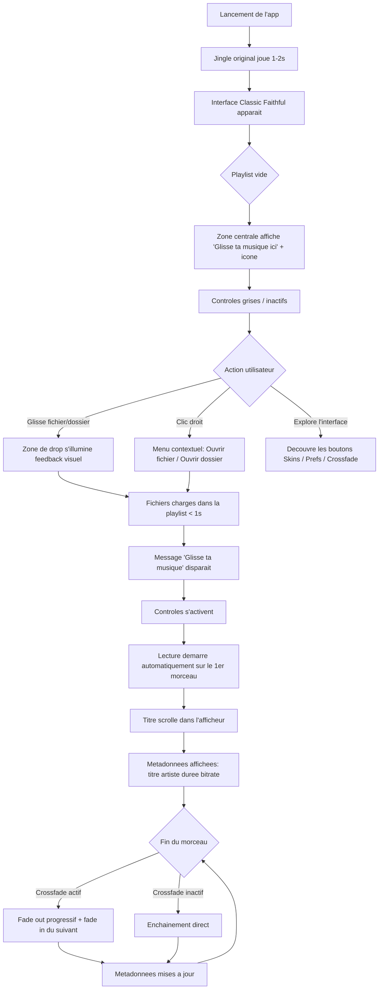
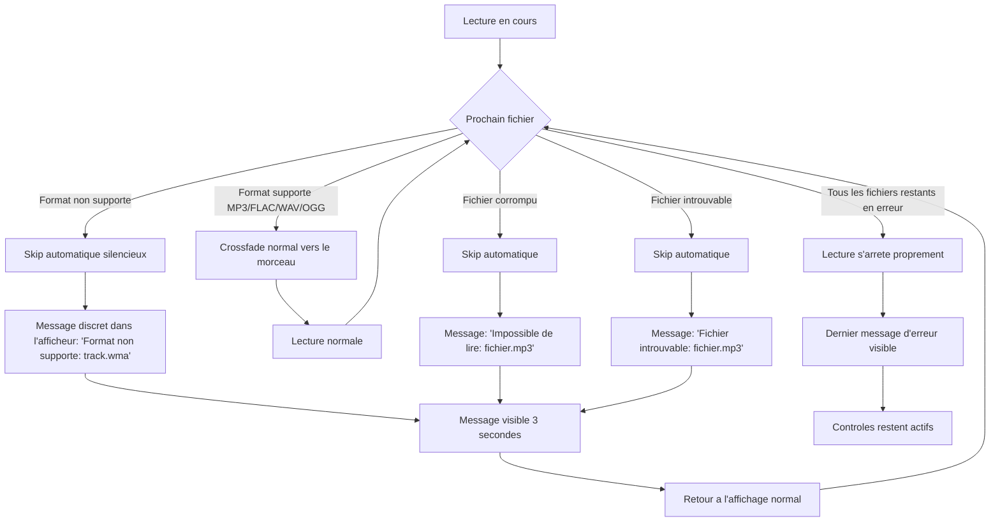
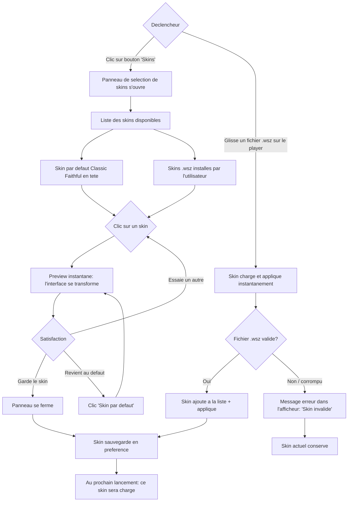
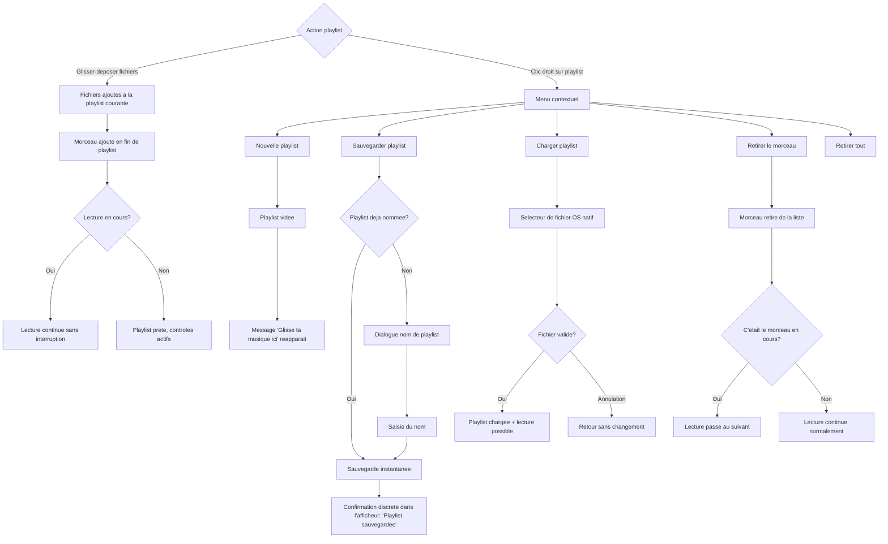

# UX Design Specification SikAmp

**Author:** Seb
**Date:** 2026-03-21

---

<!-- UX design content will be appended sequentially through collaborative workflow steps -->

## Executive Summary

### Vision Projet

SikAmp ressuscite l'experience Winamp pour 2026 : un lecteur musical desktop open-source, offline-first, sans compte ni tracking. Le crossfade natif est la feature signature qui ancre le projet dans le present. L'emotion nostalgique est le moteur principal — le moment ou l'utilisateur entend le jingle et voit l'interface, c'est la madeleine de Proust qui valide tout le projet.

### Utilisateurs Cibles

- **Marina (34 ans, nostalgique)** — veut retrouver l'experience de son adolescence. Utilisatrice quotidienne pour sa musique locale. Son moment cle : le jingle + l'interface classique au premier lancement.
- **Leo (21 ans, Gen Z curieux)** — decouvre via TikTok/memes, cherche l'aesthetic retro partageable. Ambassadeur viral.
- **Alex (29 ans, contributeur OSS)** — attire par le concept et le stack technique, contribue au code.

### Decisions UX Fondatrices

| Decision | Choix | Implication UX |
|---|---|---|
| Fidelite visuelle | Adapte aux ecrans modernes, pas reproduction pixel-perfect de la taille | Layout inspire de Winamp mais lisible sur ecrans HD/4K, proportions ajustees |
| Systeme de skins | Compatibilite format .wsz (Winamp classique) | Acces a la bibliotheque existante de milliers de skins communautaires — valeur immediate enorme |
| Premier lancement | Onboarding minimal | Jingle + indication visuelle "glisse ta musique ici" — pas de wizard, pas de friction |
| Mode de rendu | Deux modes proposes : retro pixel-perfect ET moderne lisse | Toggle ou option dans les preferences — satisfait Marina (retro) et Leo (modern aesthetic) |

### Defis UX Cles

1. **Double mode de rendu (retro/moderne)** — proposer deux experiences visuelles coherentes sans doubler le travail de design. Le mode retro doit etre authentiquement pixelise, le mode moderne doit etre fluide et anti-aliase. Les skins .wsz devront fonctionner dans les deux modes.
2. **Compatibilite .wsz sur ecrans modernes** — les skins Winamp classiques sont conçus pour des ecrans 800x600. Le scaling sur des ecrans 4K sans perdre le charme pixel-art est un defi technique et esthetique majeur.
3. **Onboarding sans friction** — communiquer les fonctionnalites (crossfade, skins, playlists) sans wizard ni tutoriel. L'interface doit etre auto-explicative.
4. **Coherence multi-plateforme** — l'experience doit etre identique sur Windows, macOS et Linux tout en respectant les conventions de chaque OS (menu bar macOS, system tray Windows, etc.).

### Opportunites UX

1. **La bibliotheque .wsz comme killer feature** — la compatibilite avec les skins existants offre des milliers de themes des le jour 1. C'est un avantage concurrentiel enorme que meme le Winamp officiel n'exploite plus correctement.
2. **L'experience "screenshot-worthy"** — Leo partage des screenshots. Si l'interface est suffisamment belle/unique, chaque utilisateur devient ambassadeur. Le mode retro pixel-art est particulierement "instagrammable".
3. **Le crossfade comme decouverte progressive** — un reglage simple mais gratifiant qui donne immediatement le sentiment que ce player fait mieux que l'original.

## Core User Experience

### Experience Fondatrice

**Action coeur :** "Lancer sa musique et la laisser tourner." L'utilisateur glisse-depose ses fichiers ou un dossier, le player prend le relais — enchainement des morceaux, crossfade fluide, zero intervention. C'est le geste fondateur qui doit etre absolument sans friction. Tout le reste (skins, playlists, preferences) est secondaire par rapport a cette boucle primaire.

**Boucle d'usage :** Glisser-deposer → lecture immediate → crossfade automatique → l'utilisateur oublie le player et profite de sa musique.

### Strategie Plateforme

- **Desktop multi-plateforme** : Windows, macOS, Linux — un seul codebase, experience identique
- **Interaction primaire** : souris + clavier (pas de touch)
- **Offline-first** : toutes les fonctions coeur sans connexion internet
- **Deux modes de rendu** : retro pixel-perfect (nearest-neighbor scaling) et moderne lisse (anti-aliasing, animations fluides) — toggle dans les preferences
- **Compatibilite skins .wsz** : acces immediat a la bibliotheque communautaire existante

### Interactions Sans Effort

| Interaction | Attendu | Seuil d'echec |
|---|---|---|
| **Glisser-deposer → lecture** | Les fichiers atterrissent dans la playlist, la lecture demarre dans la seconde | > 2 secondes = friction inacceptable |
| **Changement de skin** | Un clic, transformation instantanee de l'interface | Rechargement visible ou flash blanc = experience cassee |
| **Crossfade** | Active par defaut, transition fluide sans configuration | Artefact audio (pop, silence, crackling) = echec critique |
| **Premier lancement** | Jingle + interface + "glisse ta musique ici" — pret en < 5 secondes | Wizard, formulaire ou etape obligatoire = friction fatale |

### Moments Critiques

1. **Le tout premier lancement** — jingle + interface classique + onboarding minimal. Ce moment doit declencher l'emotion nostalgique (Marina) ou la curiosite retro (Leo). S'il ne provoque rien, le projet a echoue. C'est le moment "madeleine de Proust".

2. **Le premier glisser-deposer** — la musique doit demarrer dans la seconde. C'est la preuve que le player tient sa promesse de simplicite. Chaque seconde de latence ou etape supplementaire erode la confiance.

3. **Le premier changement de skin** — le moment ou l'outil devient *son* outil. La transformation doit etre instantanee et spectaculaire. C'est aussi le moment le plus "partageable" (screenshot → Discord/TikTok).

### Principes d'Experience

1. **Zero friction avant la musique** — aucune etape, aucun compte, aucune configuration entre le lancement et l'ecoute. Le chemin le plus court entre l'utilisateur et sa musique.

2. **Le player s'efface** — une fois la musique lancee, SikAmp disparait de l'attention. Il fait son travail (crossfade, enchainement) sans demander d'interaction. L'utilisateur oublie qu'il est la.

3. **Nostalgie avec confort moderne** — l'emotion de l'epoque avec le confort de 2026. Pas de compromis : le mode retro est authentique, le mode moderne est fluide, et les deux sont utilisables sur un ecran 4K.

4. **Personnalisation immediate** — les skins .wsz transforment l'experience en un clic. La personnalisation n'est pas un menu enfoui, c'est un geste naturel et gratifiant.

5. **Resilience silencieuse** — le player ne plante jamais, ne bloque jamais. Un format non supporte ? Skip automatique, message clair, la musique continue. L'utilisateur ne doit jamais perdre confiance.

## Desired Emotional Response

### Objectifs Emotionnels Primaires

**Par persona :**

- **Marina (nostalgique)** : **nostalgie reconfortante** — "c'est exactement comme dans mes souvenirs, mais en mieux". Le sentiment de retrouver quelque chose de perdu, comme rentrer chez soi.
- **Leo (Gen Z)** : **emerveillement retro** — "ah c'est CA qui rendait les gens fous ?!". La decouverte d'une culture qu'il n'a pas vecue, avec l'excitation de la nouveaute.
- **Alex (contributeur)** : **fierte contributive** — "ce projet est cool et j'y participe". Le plaisir du craftsmanship et de la communaute.

**Emotion federatrice :** la joie de posseder quelque chose de personnel et authentique dans un monde de streaming impersonnel.

### Parcours Emotionnel

| Moment | Emotion visee | Anti-emotion a eviter |
|---|---|---|
| Decouverte (landing page) | Curiosite + sourire | Confusion, mefiance |
| Premier lancement (jingle) | Emotion brute, coup au coeur | Indifference, agacement |
| Premier glisser-deposer | Satisfaction immediate | Frustration, attente |
| Exploration des skins | Excitation, possessivite ("*mon* player") | Overwhelm, choix paralysant |
| Crossfade entre morceaux | Surprise agreable → appreciation | Deception, artefact qui casse le flow |
| Erreur (format non supporte) | Confiance maintenue | Panique, perte de controle |
| Retour quotidien | Confort familier, habitude | Lassitude, ennui |

### Micro-Emotions

| Axe emotionnel | Cible | A eviter | Impact UX |
|---|---|---|---|
| **Confiance vs Confusion** | Confiance absolue | Confusion | Chaque interaction sans ambiguite, messages clairs, comportement previsible |
| **Emerveillement vs Satisfaction** | Emerveillement au premier contact | Simple satisfaction | Le premier lancement doit provoquer un "waow", pas juste un "ok" |
| **Appartenance vs Isolation** | Sentiment communautaire | Isolation | L'identite open-source et nostalgique cree un lien — "on est entre nous" |
| **Excitation vs Anxiete** | Excitation de la decouverte | Anxiete face a la nouveaute | Les skins et le crossfade doivent etre des decouvertes joyeuses, pas des menus complexes |

### Implications Design

| Emotion cible | Levier UX |
|---|---|
| Nostalgie reconfortante | Interface fidele a l'esthetique Winamp, jingle au lancement, skins .wsz familiers |
| Emerveillement retro | Mode pixel-perfect authentique, animations soignees, details visuels qui surprennent |
| Satisfaction immediate | Glisser-deposer → lecture en < 1 seconde, zero etape intermediaire |
| Confiance | Gestion gracieuse des erreurs, skip automatique, messages clairs et non-techniques |
| Possessivite positive | Changement de skin instantane, deux modes de rendu, le player devient "le mien" |
| Surprise agreable | Crossfade fluide par defaut — l'utilisateur decouvre la feature sans la chercher |

### Principes de Design Emotionnel

1. **L'emotion avant la fonction** — chaque decision de design est d'abord evaluee par l'emotion qu'elle provoque. Un bouton bien place qui fait sourire vaut mieux qu'une feature puissante qui laisse indifferent.

2. **Le premier contact est sacre** — le jingle + l'interface au premier lancement est le moment le plus important du produit. Il doit etre travaille avec le soin d'une scene d'ouverture de film.

3. **La confiance ne se perd qu'une fois** — un crash, un blocage ou un comportement imprevu detruit la confiance. La resilience silencieuse est un investissement emotionnel, pas juste technique.

4. **La personnalisation est un acte emotionnel** — choisir un skin n'est pas une preference technique, c'est un acte d'appropriation. Le moment doit etre gratifiant et immediat.

5. **Le retour doit etre aussi bon que la decouverte** — l'experience quotidienne doit maintenir le confort sans tomber dans la routine. Le crossfade, les transitions, les details visuels entretiennent le plaisir d'usage.

## UX Pattern Analysis & Inspiration

### Analyse des Produits Inspirants

**Winamp 2.x (1998-2003) — La Reference Fondatrice**

- **Ce qui marchait :** interface ultra-compacte, tout visible en un coup d'oeil (controles, titre, temps, playlist). Zero navigation — tout est la, sur un seul ecran. Le systeme de skins transformait un outil en objet personnel.
- **Interaction cle :** glisser-deposer un fichier → lecture immediate. Pas de bibliotheque a indexer, pas d'import, pas de scan. Direct.
- **Lecon UX :** la simplicite radicale fonctionne. Moins de surface = moins de confusion. L'utilisateur ne se demande jamais "ou est le bouton play ?".

**Winamp 5.x (2003-2013) — L'Anti-Modele**

- **Ce qui a echoue :** la "Modern Skin" a tente de moderniser l'interface avec un chrome lourd, des menus imbriques, une bibliotheque media complexe. Le resultat : perte de l'identite, confusion des utilisateurs historiques.
- **Lecon UX :** ajouter de la complexite a un produit simple detruit sa valeur. La modernisation doit preserver l'essence, pas la remplacer.

**Spotify — Le Crossfade de Reference**

- **Ce qu'on prend :** le crossfade "qui juste marche" — active dans les parametres, transition fluide, zero configuration complexe. L'utilisateur active un toggle, choisit une duree, c'est fini.
- **Ce qu'on ne prend pas :** la complexite de navigation (playlists imbriquees, algorithmes, social features). SikAmp reste un outil simple, pas une plateforme.
- **Lecon UX :** une feature puissante peut etre simple si l'interface l'expose correctement (un toggle + un slider, pas un panneau de configuration audio).

**Webamp (clone web de Winamp) — Le Benchmark Visuel**

- **Ce qu'on prend :** la preuve que l'esthetique Winamp fonctionne encore en 2026. Webamp a montre que le pixel art, les skins .wsz et l'interface classique generent un engagement emotionnel immediat sur les reseaux sociaux.
- **Ce qu'on ne prend pas :** les limitations du navigateur (pas de vrai systeme de fichiers, pas d'integration OS).
- **Lecon UX :** la fidelite visuelle a l'original est un atout, pas un handicap. Le retro n'a pas besoin d'etre "modernise" pour seduire.

### Patterns UX Transferables

**Patterns de Navigation :**

| Pattern | Source | Application SikAmp |
|---|---|---|
| **Interface monolithique** | Winamp 2.x | Tout sur un seul ecran — pas d'onglets, pas de pages, pas de navigation. Controles + playlist + metadonnees visibles en permanence |
| **Panneau detachable** | Winamp 2.x | La playlist peut etre detachee/rattachee a la fenetre principale — flexibilite sans complexite |

**Patterns d'Interaction :**

| Pattern | Source | Application SikAmp |
|---|---|---|
| **Glisser-deposer universel** | Winamp 2.x | Tout se fait par drag & drop — fichiers, dossiers, skins (.wsz). Pas de boite de dialogue "Ouvrir fichier" comme action primaire |
| **Toggle simple pour features avancees** | Spotify | Le crossfade : un toggle on/off + un slider de duree. Pas de panneau "Audio Settings" |
| **Changement de skin en temps reel** | Winamp 2.x | Selection d'un skin → application instantanee, sans redemarrage ni rechargement |

**Patterns Visuels :**

| Pattern | Source | Application SikAmp |
|---|---|---|
| **Pixel art sur fond sombre** | Winamp 2.x / Webamp | L'esthetique sombre avec texte lumineux (vert/orange sur noir) est iconique et reposante pour un usage prolonge |
| **Densite d'information elevee** | Winamp 2.x | Beaucoup d'information dans peu d'espace — bitrate, frequence, duree, titre, artiste, tout visible sans interaction |
| **Double mode de rendu** | Retro gaming (emulateurs) | Les emulateurs proposent nearest-neighbor (pixel-perfect) vs bilinear (lisse) — meme approche pour les skins .wsz |

### Anti-Patterns a Eviter

| Anti-pattern | Pourquoi l'eviter | Risque pour SikAmp |
|---|---|---|
| **Bibliotheque media a indexer** | Force l'utilisateur a attendre un scan avant d'ecouter | Casse la promesse "glisser-deposer → lecture immediate" |
| **Onboarding en plusieurs etapes** | Wizard = friction. L'utilisateur veut ecouter, pas configurer | Le premier lancement doit etre le jingle + "glisse ta musique ici", rien d'autre |
| **Interface "Modern Skin" de Winamp 5** | Complexite visuelle, perte d'identite | Le mode moderne de SikAmp doit rester compact et fidele a l'esprit, pas devenir un autre player generique |
| **Menus contextuels profonds** | Navigation cachee, decouverte difficile | Toutes les actions principales doivent etre visibles, pas enfouies dans des sous-menus |
| **Pop-ups et notifications intrusives** | Casse le flow d'ecoute, sentiment d'agression | Les mises a jour et le formulaire de satisfaction doivent etre discrets et ignorables |
| **Auto-play social / suggestions algorithmiques** | Hors scope, contraire a la philosophie du projet | SikAmp joue ce que l'utilisateur lui donne, point final |

### Strategie d'Inspiration

**Adopter tel quel :**
- Interface monolithique compacte (Winamp 2.x)
- Glisser-deposer comme interaction primaire (Winamp 2.x)
- Pixel art sur fond sombre comme esthetique par defaut (Winamp 2.x)
- Compatibilite skins .wsz (Winamp 2.x / Webamp)

**Adapter :**
- Crossfade de Spotify → simplifie en toggle + slider, integre dans les preferences minimales
- Double mode de rendu des emulateurs → applique aux skins .wsz (nearest-neighbor vs anti-aliase)
- Proportions de l'interface → ajustees pour ecrans modernes HD/4K, pas reproduction 1:1 des pixels originaux

**Eviter :**
- Toute forme de bibliotheque media ou d'indexation
- L'approche "Modern Skin" de Winamp 5 (modernisation qui trahit l'identite)
- Les menus profonds et la navigation complexe
- Tout element social, algorithmique ou connecte non demande

## Design System Foundation

### Choix du Design System

**Approche retenue : Design System Custom Skinnable**

SikAmp ne suit aucun design system standard (Material, Ant, Chakra). Le skin .wsz EST le design system — chaque skin redefinit entierement l'apparence de l'application. Le systeme est construit autour de cette realite.

### Justification de la Selection

| Facteur | Analyse | Impact sur le choix |
|---|---|---|
| **Compatibilite .wsz** | Les skins Winamp definissent chaque element visuel (boutons, sliders, textures, couleurs). Un design system classique serait ecrase par le skin. | Le skin est la source de verite visuelle, pas un systeme externe |
| **Double mode de rendu** | Retro (nearest-neighbor) et moderne (anti-aliase) sont des modes de rendering, pas des themes. Un systeme pre-construit ne gere pas cette dualite. | Le rendering est une couche separee, independante des composants |
| **Interface non-standard** | L'UI Winamp n'a aucun equivalent dans les composants standard (pas de cards, pas de nav bar, pas de formulaires). | Les composants doivent etre 100% custom, definis par le format .wsz |
| **Dev solo** | Pas d'equipe design a former sur un systeme existant. Le temps investi dans l'apprentissage d'un systeme inadapte serait perdu. | Un systeme custom cible est plus efficace qu'un systeme generique detourne |
| **Unicite du produit** | L'identite visuelle de SikAmp est son avantage concurrentiel. Un design system generique la diluerait. | Le custom garantit l'authenticite visuelle |

### Approche d'Implementation

**Architecture du Design System :**

```
Skin .wsz (fichier charge)
  └── Sprites & Textures (source visuelle)
       ├── Composants skinnes (boutons, sliders, barre de progression)
       ├── Tokens visuels (couleurs extraites, dimensions)
       └── Mode de rendu (retro / moderne)
            ├── Retro : nearest-neighbor scaling, pixels nets
            └── Moderne : anti-aliasing, transitions fluides
```

**Couches du systeme :**

1. **Couche Skin** — parseur .wsz qui extrait les sprites, textures et metadonnees du skin. C'est la source de verite pour tout l'aspect visuel.
2. **Couche Composants** — composants custom (bouton play, slider volume, texte scrollant, barre de progression) qui consomment les assets du skin.
3. **Couche Layout** — structure fixe de l'interface : main window (controles + metadonnees) + playlist editor (detachable). Le layout ne change pas entre les skins.
4. **Couche Rendering** — applique le mode retro (nearest-neighbor, pas d'anti-aliasing) ou moderne (lissage, animations) aux composants skinnes.

### Strategie de Customisation

**Ce que le skin controle :**
- Textures et sprites de tous les elements interactifs (boutons, sliders, barre de titre)
- Couleurs du texte (titre, artiste, duree, playlist)
- Fond et decorations de la fenetre
- Polices bitmap pour l'affichage des metadonnees

**Ce que le skin ne controle PAS :**
- La structure du layout (position relative des elements)
- Les comportements d'interaction (glisser-deposer, raccourcis clavier)
- Les dimensions minimales de la fenetre (adaptees aux ecrans modernes)
- Le mode de rendu (choix utilisateur, pas du skin)
- L'accessibilite (contraste minimum garanti en overlay si necessaire, navigation clavier toujours fonctionnelle)

**Skin par defaut :**
- Un skin original inspire de l'esthetique Winamp classique (fond sombre, texte vert/orange lumineux)
- Concu pour les deux modes de rendu (retro et moderne)
- Respecte les ratios de contraste WCAG AA (4.5:1 texte normal, 3:1 grande taille)
- Sert de reference et de fallback si un skin .wsz est corrompu ou incomplet

## Experience Fondatrice Detaillee

### L'Experience qui Definit SikAmp

> "Glisse ta musique, retrouve tes souvenirs."

C'est la promesse en une phrase. Si un utilisateur devait decrire SikAmp a un ami : tu glisses tes MP3 dans le player, le jingle te saute au coeur, tu choisis un skin, et ta musique enchaine avec un crossfade doux. C'est Winamp, en 2026.

### Modele Mental Utilisateur

**Marina (nostalgique) — Modele "player Winamp" :**
- S'attend a une fenetre compacte, des boutons familiers, une playlist en dessous
- Reflexe naturel : glisser un dossier directement sur la fenetre
- Connait deja le fonctionnement — zero apprentissage necessaire
- Risque : si l'interface est trop differente de ses souvenirs, dissonance cognitive

**Leo (Gen Z) — Modele "app de musique" :**
- Reference mentale : Spotify, Apple Music — recherche, bibliotheque, algorithmes
- Decouvre que l'approche glisser-deposer est plus directe que ce qu'il connait
- A besoin d'un signal visuel clair ("glisse ta musique ici") pour comprendre le paradigme
- Risque : chercher une barre de recherche ou un bouton "importer" qui n'existe pas

**Convergence des modeles :**
Les deux modeles convergent vers la meme action (glisser-deposer → lecture) mais par des chemins differents. Marina le fait par habitude, Leo le decouvre par guidage. L'onboarding minimal ("glisse ta musique ici") sert Leo sans ralentir Marina.

### Criteres de Succes de l'Experience Coeur

| Critere | Indicateur de succes | Seuil d'echec |
|---|---|---|
| **Temps jusqu'a la musique** | < 3 secondes entre le glisser-deposer et le premier son | > 5 secondes = friction inacceptable |
| **Reconnaissance immediate** | Marina sourit en voyant l'interface (test qualitatif) | "Ca ressemble a VLC" = echec d'identite |
| **Comprehension sans aide** | Leo comprend le glisser-deposer sans lire de doc | Leo cherche un bouton "importer" = onboarding insuffisant |
| **Crossfade naturel** | L'utilisateur remarque le crossfade et l'apprecie | L'utilisateur ne le remarque pas OU le remarque negativement (artefact) |
| **Envie de partager** | L'utilisateur screenshot ou montre le player a quelqu'un | L'utilisateur ferme l'app sans reaction emotionnelle |

### Patterns : Etablis vs Nouveaux

**Patterns etablis (zero apprentissage) :**
- Glisser-deposer de fichiers → standard OS, universel
- Boutons play/pause/stop/prev/next → convention universelle des players
- Slider de volume → interaction connue
- Double-clic sur un morceau dans la playlist → lance la lecture

**Patterns adaptes (familiers mais avec une touche SikAmp) :**
- Changement de skin en temps reel → familier pour les anciens de Winamp, nouveau pour Leo. Pas de menu "Themes" — interaction directe (clic droit ou menu compact)
- Panneau playlist detachable → pattern Winamp classique, rare dans les apps modernes. Decouverte naturelle par glisser la barre de separation

**Pattern nouveau (necessite guidage) :**
- Double mode de rendu (retro/moderne) → concept nouveau, necessite un toggle clair dans les preferences. Pas critique au premier lancement — decouverte secondaire.

### Mecanique de l'Experience

**1. Initiation — Le Premier Lancement**

```
Installation terminee → lancement de l'app
  → Jingle original (1-2 secondes)
  → Interface classique apparait avec skin par defaut
  → Zone centrale affiche "Glisse ta musique ici" (texte + icone)
  → Playlist vide, controles visibles mais inactifs (grises)
```

**2. Interaction — Le Glisser-Deposer**

```
L'utilisateur glisse un fichier/dossier sur la fenetre
  → Feedback visuel immediat : zone de drop s'illumine
  → Les fichiers apparaissent dans la playlist (< 1 seconde)
  → La lecture demarre automatiquement sur le premier morceau
  → Le message "Glisse ta musique ici" disparait
  → Les controles s'activent (plus grises)
  → Metadonnees du morceau s'affichent (titre, artiste, duree)
```

**3. Feedback — La Lecture en Cours**

```
Morceau en lecture :
  → Titre scrolle dans l'afficheur (texte defilant classique Winamp)
  → Barre de progression avance en temps reel
  → Temps ecoule / temps total affiche
  → Bitrate et frequence affiches (detail nostalgique)

Transition crossfade :
  → Le morceau en cours commence a baisser en volume (fade out)
  → Le morceau suivant demarre simultanement en volume croissant (fade in)
  → Transition fluide, sans silence ni artefact
  → L'afficheur met a jour les metadonnees du nouveau morceau
```

**4. Completion — La Boucle Continue**

```
Fin de la playlist :
  → Le player s'arrete proprement sur le dernier morceau
  → Les controles restent actifs (replay possible)
  → Pas de pop-up, pas de suggestion, pas de bruit

L'utilisateur revient le lendemain :
  → L'app s'ouvre avec le dernier skin utilise
  → La derniere playlist est toujours chargee
  → Le jingle joue (sauf si desactive)
  → Pret a jouer en < 5 secondes
```

## Visual Design Foundation

### Systeme de Couleurs

**Palette du Skin par Defaut (reference iconique) :**

| Role | Couleur | Hex | Usage |
|---|---|---|---|
| **Fond principal** | Gris metallique fonce | #29292E | Corps de la fenetre, barre de titre |
| **Fond afficheur** | Noir profond | #000000 | Zone d'affichage des metadonnees et du temps |
| **Texte afficheur (primaire)** | Vert lumineux | #00FF00 | Titre scrollant, temps ecoule, bitrate |
| **Texte afficheur (secondaire)** | Vert attenue | #00CC00 | Informations secondaires (frequence, mode stereo) |
| **Texte playlist** | Vert clair | #00FF00 | Morceaux dans la playlist |
| **Texte playlist (selectionne)** | Blanc | #FFFFFF | Morceau en cours de lecture |
| **Fond playlist** | Noir | #000000 | Zone de la playlist |
| **Accents metalliques** | Gris clair | #5A5A5F | Bordures, reliefs, details de texture |
| **Controles (actifs)** | Teintes claires sur fond metallique | — | Boutons, sliders — definis par les sprites du skin |
| **Controles (inactifs)** | Grises | #555555 | Controles desactives avant chargement de musique |

**Particularite du systeme de couleurs :**
Les couleurs ci-dessus sont celles du skin par defaut uniquement. Chaque skin .wsz charge redefinit entierement la palette. Le systeme de couleurs n'est donc pas un token fixe — c'est une couche dynamique pilotee par le skin actif.

**Couleurs semantiques (hors skin, UI systeme) :**

| Role | Couleur | Usage |
|---|---|---|
| **Erreur** | #FF4444 | Message "format non supporte" |
| **Succes** | #44FF44 | Confirmation d'action (playlist sauvegardee) |
| **Info** | #4488FF | Notification de mise a jour disponible |

**Accessibilite :**
- Le skin par defaut (#00FF00 sur #000000) offre un ratio de contraste de 15.3:1 — largement au-dessus du WCAG AA (4.5:1)
- Les skins .wsz communautaires ne garantissent pas les ratios WCAG — un overlay d'accessibilite optionnel pourra etre active dans les preferences si necessaire

### Systeme Typographique

**Approche duale :**

| Zone | Type de police | Justification |
|---|---|---|
| **Afficheur principal** | Police bitmap pixelisee (custom, inspiree de l'original) | Authenticite visuelle, texte scrollant iconique, fidelite a l'esthetique Winamp |
| **Playlist** | Police systeme (sans-serif) | Lisibilite, densite d'information, tailles variables selon l'ecran |
| **Menus et preferences** | Police systeme (sans-serif) | Coherence OS, accessibilite, lisibilite standard |

**Police bitmap de l'afficheur :**
- Creee sur mesure, inspiree de la police Winamp originale (pas de reutilisation directe — droits)
- Caracteres monoespace pour l'affichage du temps (00:00 / 00:00)
- Support du scrolling horizontal pour les titres longs
- En mode retro : rendu nearest-neighbor (pixels nets)
- En mode moderne : legere interpolation pour adoucir sans perdre le caractere

**Police systeme :**
- Utilise la police sans-serif par defaut de chaque OS (Segoe UI sur Windows, SF Pro sur macOS, system-ui sur Linux)
- Garantit la coherence avec l'environnement de l'utilisateur
- Respecte les preferences de taille de police de l'OS pour l'accessibilite

**Echelle typographique :**

| Element | Taille (base 1x) | Usage |
|---|---|---|
| Titre scrollant (afficheur) | 8px bitmap (scalee selon facteur) | Titre + artiste du morceau en cours |
| Temps (afficheur) | 28px bitmap (scalee) | Temps ecoule, grand affichage central |
| Playlist (morceau) | 12px systeme | Chaque ligne de la playlist |
| Playlist (header) | 11px systeme | En-tetes de colonnes (titre, artiste, duree) |
| Menus | 13px systeme | Options de menu contextuel et preferences |

### Espacement & Layout

**Philosophie : densite aeree**

On conserve la sensation de densite de Winamp (beaucoup d'information dans peu d'espace) tout en aerant legerement pour le confort sur ecrans modernes. Le principe : l'interface doit donner la sensation d'un cockpit compact, pas d'une page web aeree.

**Unite de base : 2px (scalee)**

| Espacement | Valeur (1x) | Usage |
|---|---|---|
| **Micro** | 2px | Entre elements tres proches (icone + label) |
| **Petit** | 4px | Padding interne des boutons, marges entre controles |
| **Moyen** | 8px | Separation entre zones fonctionnelles (controles / afficheur) |
| **Grand** | 12px | Marge entre la fenetre principale et la playlist detachee |

**Facteur de scale :**
- L'interface est concue a un facteur de base (1x) correspondant a environ 275x116 pixels pour la fenetre principale (proportions Winamp classique)
- Le facteur de scale s'adapte a la resolution de l'ecran : 2x pour Full HD, 3x pour 4K
- En mode retro : scaling par multiples entiers uniquement (2x, 3x, 4x) pour preserver les pixels nets
- En mode moderne : scaling libre avec anti-aliasing

**Structure du layout :**

```
┌─────────────────────────────────────┐
│ Barre de titre (drag, minimize, close) │
├─────────────────────────────────────┤
│ Afficheur (titre scrollant, temps,  │
│ bitrate, frequence, stereo/mono)    │
├─────────────────────────────────────┤
│ Controles (prev/play/pause/stop/next│
│ + slider volume + slider position)  │
├─────────────────────────────────────┤
│ Barre d'actions (shuffle, repeat,   │
│ crossfade toggle, skin, prefs)      │
└─────────────────────────────────────┘
         ↕ (detachable)
┌─────────────────────────────────────┐
│ Playlist Editor                     │
│ (liste des morceaux, scrollable,    │
│  reordonnable par drag & drop)      │
└─────────────────────────────────────┘
```

### Considerations d'Accessibilite

- **Contraste** : le skin par defaut depasse les exigences WCAG AA (15.3:1). Les skins .wsz communautaires ne sont pas garantis — un mode "high contrast overlay" sera disponible en option.
- **Taille de texte** : l'echelle typographique respecte les preferences systeme de l'utilisateur pour la police systeme. La police bitmap de l'afficheur scale avec le facteur de l'interface.
- **Navigation clavier** : toutes les zones (controles, playlist, menus) sont navigables au clavier (Tab / Fleches / Entree / Espace) independamment du theme visuel.
- **Lecteurs d'ecran** : les controles principaux exposent des labels ARIA (play, pause, volume, etc.) meme si l'interface est entierement graphique/sprite-based.
- **Mode de rendu** : le mode moderne offre une meilleure lisibilite native ; le mode retro privilegie l'authenticite — l'utilisateur choisit selon ses besoins.

## Design Direction Decision

### Directions Explorees

Six directions visuelles ont ete generees et comparees (voir `ux-design-directions.html`) :

1. **Classic Faithful** — gris metallique + vert lumineux, bordures en relief, fidelite Winamp 2.x
2. **Dark Neon** — noir profond + accents cyan/magenta, glow effects, ambiance cyberpunk
3. **Warm Retro** — palette ambre/orange, ambiance chaleureuse annees 2000
4. **Minimal Steel** — surfaces plates, bleu acier subtil, elegance contemporaine
5. **Y2K Revival** — violet/jaune/rose vifs, gradients audacieux, esthetique Y2K maximale
6. **Midnight Mode** — ultra-noir, blanc pur, minimalisme extreme

### Direction Retenue

**Classic Faithful** — la reproduction fidele de l'esthetique Winamp 2.x est la direction retenue pour le skin par defaut.

### Justification

| Critere | Evaluation |
|---|---|
| **Reconnaissance immediate** | Marina reconnait instantanement "son" Winamp — le gris metallique et le vert lumineux sont graves dans la memoire collective |
| **Coherence avec la vision** | Le projet promet "Et si Winamp etait sorti en 2026 ?" — le skin par defaut doit incarner Winamp, pas une reinterpretation |
| **Premier lancement sacre** | L'emotion nostalgique au premier contact depend de la fidelite visuelle. Classic Faithful maximise ce moment |
| **Base de reference** | C'est le skin le plus proche du format .wsz original — il sert de reference pour la compatibilite avec les skins communautaires |
| **Leo aussi en profite** | Meme pour un Gen Z qui n'a pas connu Winamp, c'est cette esthetique qu'il a vue dans les memes et videos. Le "vrai" Winamp, c'est ca |

### Approche d'Implementation

**Skin par defaut (Classic Faithful) :**
- Fond gris metallique (#29292E) avec gradients subtils et bordures en relief (style outset/inset)
- Afficheur noir (#000000) avec texte vert lumineux (#00FF00)
- Controles avec effet de profondeur (boutons 3D classiques)
- Barre de progression verte sur fond sombre
- Playlist en vert sur noir, morceau actif en blanc

**Les autres directions comme skins additionnels :**
- Dark Neon, Warm Retro, Y2K Revival, Minimal Steel et Midnight Mode pourront etre proposes comme skins pre-installes ou comme inspiration pour la communaute
- Chaque direction exploree ici peut servir de base a un skin .wsz officiel en V2 (phase "bibliotheque de skins pre-installes")

**Fichier de reference :**
- `ux-design-directions.html` conserve dans les artefacts de planification comme reference visuelle pour l'equipe et les contributeurs

## User Journey Flows

### Flow 1 : Premier Lancement + Premier Glisser-Deposer

**Contexte :** Marina ou Leo lance SikAmp pour la premiere fois. C'est le moment sacre — l'emotion doit etre immediate.



**Points de design critiques :**
- Le jingle joue PENDANT le chargement de l'interface, pas avant — pas d'ecran noir
- Le feedback de drop (illumination) doit etre instantane (< 100ms)
- La lecture automatique au premier drop est un choix delibere : zero friction
- Si l'utilisateur glisse un dossier contenant 500+ fichiers, la playlist se charge progressivement sans bloquer l'UI — la lecture demarre des le premier fichier charge

---

### Flow 2 : Gestion des Erreurs en Lecture

**Contexte :** Marina charge un dossier contenant des formats mixtes (MP3, FLAC, et quelques .wma non supportes).



**Principes de resilience :**
- Le player ne plante JAMAIS — chaque erreur est geree gracieusement
- Les messages d'erreur sont affiches dans l'afficheur existant (pas de pop-up, pas de modal)
- Le crossfade s'adapte : si le morceau suivant est en erreur, on skip jusqu'au prochain morceau valide et le crossfade s'applique a celui-ci
- L'erreur n'interrompt jamais le flux audio — la musique continue

---

### Flow 3 : Changement de Skin

**Contexte :** L'utilisateur veut personnaliser son player avec un autre skin.



**Points de design critiques :**
- L'application du skin est instantanee — pas de rechargement, pas de flash blanc, pas de transition
- Le glisser-deposer d'un .wsz fonctionne comme le glisser-deposer de musique : naturel et immediat
- La liste de skins affiche des miniatures si possible (preview du skin sans l'appliquer)
- Un skin corrompu ne casse jamais l'interface — fallback silencieux sur le skin actuel

---

### Flow 4 : Gestion de Playlists

**Contexte :** Usage quotidien — creer, sauvegarder, charger des playlists.



**Principes de gestion :**
- Le drag & drop dans la playlist permet de reordonner les morceaux (grab + move)
- La sauvegarde est toujours non-destructive : sauvegarder une playlist n'efface pas les autres
- Le format de sauvegarde est compatible avec les standards existants (M3U/M3U8)
- Ajouter des morceaux pendant la lecture ne l'interrompt JAMAIS

---

### Patterns de Journey

**Patterns communs identifies :**

| Pattern | Description | Utilise dans |
|---|---|---|
| **Feedback dans l'afficheur** | Tous les messages (erreurs, confirmations, infos) s'affichent dans l'afficheur existant, pas dans des pop-ups | Flows 1, 2, 3, 4 |
| **Glisser-deposer universel** | Fichiers audio, dossiers, skins .wsz — tout se depose sur le player | Flows 1, 3, 4 |
| **Fallback silencieux** | En cas d'erreur, l'etat precedent est preserve sans action de l'utilisateur | Flows 2, 3 |
| **Zero interruption de lecture** | Aucune action (ajout, suppression, changement de skin, erreur) n'interrompt la musique en cours | Flows 2, 3, 4 |
| **Persistance automatique** | Le skin, la playlist et les preferences sont sauvegardes automatiquement | Flows 3, 4 |

### Principes d'Optimisation des Flows

1. **Moins de clics, plus de drag** — le glisser-deposer est toujours plus rapide qu'un menu. Les menus existent comme alternative, pas comme chemin principal.

2. **Feedback ephemere** — les messages de confirmation/erreur apparaissent 3 secondes dans l'afficheur puis disparaissent. Pas de bouton "OK" a cliquer, pas de modal a fermer.

3. **Etat toujours recuperable** — aucune action n'est definitive sans confirmation. Retirer un morceau le retire de la playlist, pas du disque. Un skin rate ne casse rien.

4. **La lecture est sacree** — la musique ne s'arrete que si l'utilisateur le decide explicitement (bouton stop, ou fin de playlist). Tout le reste se passe en parallele.

## Component Strategy

### Inventaire des Composants

Tous les composants sont custom — le design system skinnable ne repose sur aucune bibliotheque de composants existante. Chaque composant consomme les assets du skin .wsz actif.

#### Composants Fenetre Principale

**1. TitleBar**
- **Role :** Barre de titre de la fenetre, identite du player
- **Contenu :** Nom de l'app + titre du morceau en cours
- **Actions :** Drag pour deplacer la fenetre, boutons minimize/close
- **Etats :** Actif (fenetre au premier plan), inactif (arriere-plan)
- **Skinning :** Texture de fond, couleur du texte, sprites des boutons — definis par le .wsz
- **Accessibilite :** Les boutons minimize/close sont focusables au clavier, labels ARIA "Reduire" / "Fermer"

**2. Display (Afficheur)**
- **Role :** Zone d'information principale — le "visage" du player
- **Contenu :** Titre scrollant (artiste — titre), temps ecoule/total, bitrate, frequence, stereo/mono, format
- **Actions :** Clic sur le temps pour basculer entre temps ecoule et temps restant
- **Etats :** En lecture (titre scrolle, temps avance), en pause (titre fige, temps fige), a l'arret (vide ou dernier morceau), message feedback (erreur/confirmation affichee 3s)
- **Skinning :** Fond, couleur du texte, police bitmap — definis par le .wsz
- **Accessibilite :** Le titre et le temps sont exposes comme texte live region (ARIA) pour les lecteurs d'ecran

**3. SeekBar (Barre de Progression)**
- **Role :** Navigation dans le morceau en cours
- **Contenu :** Progression visuelle (barre remplie + curseur)
- **Actions :** Clic pour sauter a une position, drag du curseur pour scrubber
- **Etats :** Actif (morceau en lecture), inactif (pas de morceau), hover (preview de la position)
- **Skinning :** Texture de fond, couleur/texture de la barre de progression, sprite du curseur — definis par le .wsz
- **Accessibilite :** Slider ARIA avec valeur min/max/current, navigable au clavier (fleches gauche/droite)

**4. TransportControls (Controles de Lecture)**
- **Role :** Controles de lecture principaux
- **Contenu :** 5 boutons — Previous, Play, Pause, Stop, Next
- **Actions :** Clic sur chaque bouton declenche l'action correspondante
- **Etats par bouton :** Normal, hover (surbrillance), pressed (enfonce), disabled (grise, pas de morceau charge)
- **Skinning :** Sprites des boutons dans chaque etat — definis par le .wsz (sprite sheet classique Winamp)
- **Accessibilite :** Chaque bouton a un label ARIA explicite, navigable au clavier (Tab + Entree/Espace)

**5. VolumeSlider**
- **Role :** Controle du volume
- **Contenu :** Icone volume + slider horizontal
- **Actions :** Drag du slider, clic sur l'icone pour mute/unmute
- **Etats :** Volume 0 (mute, icone barree), volume bas (1-33%), volume moyen (34-66%), volume fort (67-100%)
- **Skinning :** Sprite de l'icone, texture du slider — definis par le .wsz
- **Accessibilite :** Slider ARIA avec valeur 0-100%, navigable au clavier (fleches haut/bas), label "Volume"

**6. ActionBar (Barre d'Actions)**
- **Role :** Actions secondaires et toggles
- **Contenu :** Boutons Shuffle, Repeat, Crossfade, Skins, Prefs
- **Actions :** Toggle on/off pour Shuffle, Repeat, Crossfade. Ouverture de panneaux pour Skins et Prefs
- **Etats par bouton :** Off (normal), on (active, visuellement distinct), hover
- **Skinning :** Sprites des boutons, couleur d'accentuation pour l'etat actif — definis par le .wsz
- **Accessibilite :** Chaque toggle a un role "switch" ARIA avec etat on/off annonce

#### Composants Playlist

**7. PlaylistPanel**
- **Role :** Panneau de gestion de la playlist, detachable de la fenetre principale
- **Contenu :** Header (nom de la playlist), colonnes (# / Titre / Artiste / Duree), liste de morceaux, barre de statut
- **Actions :** Detacher/rattacher par drag de la barre de separation, scroll, redimensionner
- **Etats :** Attachee (sous la fenetre principale), detachee (fenetre independante), vide (message "Glisse ta musique ici")
- **Skinning :** Fond, couleurs du texte, couleur de selection — definis par le .wsz
- **Accessibilite :** Liste ARIA avec role "listbox", annonce du nombre de morceaux

**8. PlaylistItem**
- **Role :** Ligne individuelle representant un morceau
- **Contenu :** Numero, titre, artiste, duree
- **Actions :** Double-clic pour lancer la lecture, clic droit pour menu contextuel, drag pour reordonner
- **Etats :** Normal, hover, selectionne, en cours de lecture (highlight fort), en erreur (format non supporte — affiche grise)
- **Skinning :** Couleur du texte normal, couleur du texte actif, couleur de fond hover/selection — definis par le .wsz
- **Accessibilite :** Role "option" ARIA, annonce "en cours de lecture" pour le morceau actif

**9. PlaylistDropZone**
- **Role :** Zone de reception pour le glisser-deposer de fichiers
- **Contenu :** Message "Glisse ta musique ici" + icone (visible quand playlist vide), feedback de drop (visible pendant le drag)
- **Actions :** Reception de fichiers audio et dossiers par drag & drop
- **Etats :** Invisible (playlist non vide), visible (playlist vide), active (fichiers en cours de drag au-dessus — illumination)
- **Skinning :** Couleur du message, icone — adaptes au skin actif
- **Accessibilite :** Label ARIA "Zone de depot de fichiers", annonce du nombre de fichiers deposes

#### Composants Transversaux

**10. SkinSelector**
- **Role :** Panneau de selection et gestion des skins
- **Contenu :** Liste de skins disponibles avec miniatures, skin actif en surbrillance, skin par defaut en tete
- **Actions :** Clic pour appliquer un skin (preview instantane), drag & drop d'un .wsz pour ajouter un skin
- **Etats :** Ferme (invisible), ouvert (panneau overlay ou panneau lateral)
- **Skinning :** Le panneau lui-meme utilise le skin actif — il change d'apparence en temps reel quand on selectionne un skin
- **Accessibilite :** Liste ARIA avec role "listbox", annonce du skin selectionne

**11. ContextMenu**
- **Role :** Menu contextuel au clic droit
- **Contenu :** Actions contextuelles selon la zone cliquee (playlist : ouvrir/sauvegarder/retirer, player : preferences/skins)
- **Actions :** Clic sur une option execute l'action
- **Etats :** Ferme (invisible), ouvert (positionne au curseur)
- **Skinning :** Fond, couleur du texte, couleur hover — definis par le .wsz ou fallback sur le style systeme
- **Accessibilite :** Role "menu" ARIA, navigation au clavier (fleches haut/bas + Entree)

**12. FeedbackMessage**
- **Role :** Messages ephemeres affiches dans l'afficheur (pas de pop-up)
- **Contenu :** Texte du message (erreur, confirmation, info)
- **Actions :** Aucune — apparait 3 secondes puis disparait
- **Etats :** Erreur (texte rouge #FF4444), succes (texte vert #44FF44), info (texte bleu #4488FF)
- **Skinning :** Affiche dans la zone Display existante, utilise les couleurs semantiques (hors skin)
- **Accessibilite :** Live region ARIA "polite" — annonce automatique par les lecteurs d'ecran

**13. PreferencesPanel**
- **Role :** Panneau de preferences minimal
- **Contenu :** Crossfade (toggle on/off + slider duree 1-12s), jingle au lancement (toggle on/off), mode de rendu (retro/moderne), volume du jingle
- **Actions :** Toggle et sliders pour chaque preference
- **Etats :** Ferme (invisible), ouvert (panneau overlay)
- **Skinning :** Utilise le skin actif pour le fond et les couleurs
- **Accessibilite :** Chaque controle est labelle et navigable au clavier

### Strategie d'Implementation des Composants

**Principes :**
- Chaque composant est un module autonome qui consomme les assets du skin actif
- Le changement de skin met a jour les assets de tous les composants simultanement (pas de rechargement)
- Les etats d'accessibilite (ARIA) sont independants du skin — toujours fonctionnels
- Les composants communiquent par evenements (play, pause, skin-changed, playlist-updated) — couplage faible

**Architecture :**

```
SkinEngine (charge et parse le .wsz)
  ↓ fournit les assets a
ComponentRenderer (applique les sprites/textures)
  ↓ rend
Composants individuels (TitleBar, Display, Controls, etc.)
  ↓ emettent
EventBus (play, pause, seek, volume, skin-changed, etc.)
  ↓ consomme
AudioEngine (lecture, crossfade, gestion d'erreurs)
```

### Roadmap d'Implementation

**Phase 1 — MVP Core (indispensable au lancement) :**

| Priorite | Composant | Justification |
|---|---|---|
| P0 | Display | Le "visage" du player — premier contact visuel |
| P0 | TransportControls | Sans controles, pas de player |
| P0 | SeekBar | Navigation dans le morceau |
| P0 | VolumeSlider | Controle du volume |
| P0 | TitleBar | Identite + gestion de fenetre |
| P0 | PlaylistPanel + PlaylistItem | Gestion de la musique |
| P0 | PlaylistDropZone | Point d'entree principal (glisser-deposer) |
| P0 | FeedbackMessage | Gestion d'erreurs gracieuse |
| P0 | ActionBar | Crossfade toggle (feature signature) |

**Phase 2 — Experience Complete :**

| Priorite | Composant | Justification |
|---|---|---|
| P1 | SkinSelector | Personnalisation — moment emotionnel cle |
| P1 | ContextMenu | Actions secondaires (clic droit) |
| P1 | PreferencesPanel | Configuration crossfade, jingle, mode rendu |

## UX Consistency Patterns

### Hierarchie d'Interaction

**Principe : le geste le plus naturel est toujours le plus rapide.**

| Niveau | Methode | Usage | Temps utilisateur |
|---|---|---|---|
| **1. Drag & Drop** | Glisser-deposer | Action primaire — ajouter de la musique, installer un skin, reordonner la playlist | < 1 seconde |
| **2. Clic direct** | Clic sur un controle visible | Actions de lecture, toggles, selection de skin | < 0.5 seconde |
| **3. Double-clic** | Double-clic sur un element | Lancer un morceau specifique dans la playlist | < 0.5 seconde |
| **4. Clic droit** | Menu contextuel | Actions secondaires (sauvegarder, retirer, ouvrir fichier) | 1-2 secondes |
| **5. Raccourci clavier** | Combinaison de touches | Power users — controle sans souris | Instantane |

**Regles :**
- Toute action accessible par clic droit doit aussi etre accessible par un controle visible ou un raccourci clavier
- Le drag & drop est toujours accompagne d'un feedback visuel (zone illuminee, curseur modifie)
- Le double-clic n'est JAMAIS le seul moyen d'acceder a une action — il est un raccourci, pas un chemin unique

### Feedback et Etats

**Pattern : Feedback dans l'Afficheur**

Tous les messages utilisent l'afficheur existant (composant Display). Jamais de pop-up, modal ou notification systeme pour les actions internes.

| Type | Couleur | Duree | Exemples |
|---|---|---|---|
| **Erreur** | #FF4444 | 3 secondes | "Format non supporte: track.wma", "Fichier introuvable" |
| **Succes** | #44FF44 | 3 secondes | "Playlist sauvegardee", "Skin applique" |
| **Info** | #4488FF | 3 secondes | "Mise a jour disponible" |
| **Lecture** | Couleur du skin | Permanent (pendant la lecture) | Titre scrollant, temps, bitrate |

**Regles :**
- Un message feedback remplace temporairement le titre scrollant, puis l'affichage normal revient
- Si plusieurs erreurs se produisent en rafale (ex : 5 fichiers non supportes d'affilee), seul le dernier message est affiche — pas d'empilement
- Les messages ne bloquent JAMAIS l'interaction — l'utilisateur peut continuer a agir pendant l'affichage

**Pattern : Etats des Controles**

| Etat | Apparence | Quand |
|---|---|---|
| **Normal** | Sprite par defaut du skin | Controle disponible, pas d'interaction |
| **Hover** | Sprite surbrillance ou legeement eclairci | Souris au-dessus du controle |
| **Pressed** | Sprite enfonce (inset) | Clic en cours |
| **Disabled** | Sprite grise, opacite reduite | Pas de morceau charge, action impossible |
| **Active (toggle)** | Sprite distinct, couleur d'accentuation | Toggle ON (shuffle, repeat, crossfade) |

**Regles :**
- La transition entre etats est instantanee en mode retro (pas d'animation)
- En mode moderne : transition de 100ms (ease-out) entre les etats
- L'etat disabled est toujours visuellement distinct — jamais confondu avec l'etat normal

### Gestion d'Erreurs

**Pattern : Resilience Silencieuse**

| Situation | Comportement | Message |
|---|---|---|
| Format audio non supporte | Skip automatique, lecture du suivant | "Format non supporte: [fichier]" (3s) |
| Fichier corrompu | Skip automatique, lecture du suivant | "Impossible de lire: [fichier]" (3s) |
| Fichier introuvable (deplace/supprime) | Skip automatique, lecture du suivant | "Fichier introuvable: [fichier]" (3s) |
| Skin .wsz invalide ou corrompu | Skin actuel conserve | "Skin invalide: [fichier]" (3s) |
| Playlist vide apres suppressions | Retour a l'etat initial | Message "Glisse ta musique ici" reapparait |
| Tous les fichiers en erreur | Lecture s'arrete proprement | Dernier message d'erreur affiche |
| Mise a jour echouee (pas de connexion) | Silencieusement ignore | Aucun message — offline-first |

**Regles :**
- Le player ne crash JAMAIS — chaque erreur a un chemin de recuperation
- L'erreur ne produit JAMAIS un etat bloque — l'utilisateur peut toujours agir
- Les erreurs sont informatives mais pas alarmantes — ton neutre, pas d'icone d'alerte

### Overlays et Panneaux

**Pattern : Panneau Overlay**

Utilise pour SkinSelector et PreferencesPanel.

| Propriete | Specification |
|---|---|
| **Position** | Overlay au-dessus du player, ancre a la fenetre |
| **Ouverture** | Clic sur le bouton correspondant dans l'ActionBar |
| **Fermeture** | Clic sur le bouton a nouveau, clic en dehors du panneau, ou touche Escape |
| **Fond** | Semi-transparent ou opaque selon le skin, avec le style du skin actif |
| **Animation (mode retro)** | Apparition instantanee — pas de transition |
| **Animation (mode moderne)** | Fade-in 150ms |
| **Interaction avec la lecture** | La musique continue normalement — le panneau ne bloque rien |

**Regles :**
- Un seul panneau ouvert a la fois — ouvrir SkinSelector ferme PreferencesPanel et vice versa
- Le panneau ne depasse JAMAIS les limites de la fenetre du player
- Le contenu du panneau est navigable au clavier (Tab pour parcourir, Escape pour fermer)

### Raccourcis Clavier

**Raccourcis Globaux (fonctionnent meme quand l'app n'est pas au premier plan) :**

| Raccourci | Action |
|---|---|
| **Media Play/Pause** | Play / Pause |
| **Media Next** | Morceau suivant |
| **Media Previous** | Morceau precedent |
| **Media Stop** | Stop |

*Note : les raccourcis globaux sont prevus pour la Phase 1.5 (integrations systeme), pas le MVP.*

**Raccourcis Locaux (quand le player a le focus) :**

| Raccourci | Action |
|---|---|
| **Espace** | Play / Pause |
| **S** | Stop |
| **Fleche droite** | Avance rapide (seek +5s) |
| **Fleche gauche** | Retour rapide (seek -5s) |
| **Fleche haut** | Volume +5% |
| **Fleche bas** | Volume -5% |
| **N** | Morceau suivant |
| **P** | Morceau precedent |
| **R** | Toggle Repeat |
| **H** | Toggle Shuffle |
| **X** | Toggle Crossfade |
| **M** | Mute / Unmute |
| **Escape** | Fermer le panneau ouvert |
| **Ctrl+S** | Sauvegarder la playlist |
| **Ctrl+O** | Ouvrir un fichier |
| **Ctrl+L** | Charger une playlist |

**Regles :**
- Les raccourcis locaux sont inspires des raccourcis Winamp classiques quand c'est possible
- Les raccourcis ne sont pas remappables en V1 (possible en V2)
- Un raccourci clavier ne produit JAMAIS une action sans feedback visuel — l'afficheur confirme toujours

### Integration avec le Design System Skinnable

**Comment les patterns interagissent avec les skins :**

| Pattern | Controle par le skin | Fixe (hors skin) |
|---|---|---|
| Hierarchie d'interaction | — | Ordre de priorite des gestes |
| Feedback dans l'afficheur | Couleur du texte en lecture | Couleurs semantiques (erreur/succes/info), duree 3s |
| Etats des controles | Sprites par etat (normal/hover/pressed/disabled/active) | Timing des transitions, logique des etats |
| Resilience silencieuse | — | Comportement de skip, messages, logique de fallback |
| Overlays et panneaux | Style visuel du panneau | Logique d'ouverture/fermeture, un seul panneau a la fois |
| Raccourcis clavier | — | Mapping des touches, actions declenchees |

## Responsive Design & Accessibilite

### Strategie de Redimensionnement

**Contexte :** SikAmp est une application desktop — pas de responsive mobile/tablette. Le "responsive" se traduit par l'adaptation de l'interface aux differentes resolutions d'ecran et tailles de fenetre.

**Contraintes de fenetre :**

| Propriete | Valeur |
|---|---|
| **Taille minimale** | 800x400 pixels |
| **Taille maximale** | Pas de limite — l'utilisateur est libre |
| **Taille par defaut au premier lancement** | Adaptee a la resolution de l'ecran (proportions Winamp, scale 2x ou 3x selon la densite) |
| **Redimensionnement** | Libre, l'interface s'adapte |
| **Memorisation** | La taille et position de la fenetre sont sauvegardees entre les sessions |

**Comportement au redimensionnement :**

| Zone | Comportement |
|---|---|
| **Fenetre principale (controles + afficheur)** | Hauteur fixe, largeur s'adapte. L'afficheur s'etire horizontalement, les controles restent centres. |
| **Playlist** | Prend tout l'espace vertical restant. Le nombre de morceaux visibles augmente avec la hauteur. |
| **Colonnes playlist** | La colonne "Titre" s'etire, les colonnes "Artiste" et "Duree" gardent leur largeur fixe. |
| **Afficheur** | Le titre scrollant dispose de plus d'espace, le temps et les metadonnees restent a leur position. |

### Strategie de Scaling

**Mode retro :**
- Scaling par multiples entiers uniquement (1x, 2x, 3x, 4x)
- Nearest-neighbor — pixels nets, pas d'interpolation
- Le facteur de scale est choisi automatiquement selon la resolution de l'ecran, modifiable dans les preferences
- Sur un ecran 4K : scale 3x par defaut (interface d'environ 825x348 pour la fenetre principale)

**Mode moderne :**
- Scaling libre — s'adapte fluidement a la taille de fenetre
- Anti-aliasing applique aux sprites et textures du skin
- Les polices bitmap de l'afficheur sont rendues avec interpolation legere
- Animations de transition lors du redimensionnement (150ms ease-out)

### Strategie d'Accessibilite

**Niveau vise :** WCAG AA comme objectif progressif — pas de certification formelle en V1, mais engagement ethique a integrer l'accessibilite des le depart.

**Cibles V1 :**

| Technologie d'assistance | Plateforme | Priorite |
|---|---|---|
| **VoiceOver** | macOS | V1 |
| **NVDA** | Windows | V1 |
| **Orca** | Linux | V2 |
| **JAWS** | Windows | V2 |

**Exigences d'accessibilite V1 :**

**Navigation clavier complete :**

| Zone | Navigation | Activation |
|---|---|---|
| TransportControls | Tab entre les boutons | Entree ou Espace |
| SeekBar | Tab pour focus, fleches gauche/droite pour seek | — |
| VolumeSlider | Tab pour focus, fleches haut/bas pour volume | — |
| ActionBar | Tab entre les boutons | Entree ou Espace pour toggle |
| PlaylistPanel | Tab pour entrer dans la liste, fleches haut/bas pour naviguer | Entree pour lancer un morceau |
| SkinSelector | Tab pour entrer, fleches pour parcourir | Entree pour appliquer |
| PreferencesPanel | Tab entre les controles | Entree/Espace pour toggle, fleches pour sliders |
| ContextMenu | Touche Menu ou Shift+F10 pour ouvrir, fleches pour naviguer | Entree pour selectionner |

**Indicateurs de focus :**
- Chaque element focusable a un indicateur de focus visible (contour ou surbrillance)
- En mode retro : contour pointille 1px dans la couleur d'accentuation du skin
- En mode moderne : contour lisse 2px avec glow subtil
- L'indicateur de focus n'est JAMAIS masque par le skin — c'est un overlay independant

**Labels ARIA :**

| Composant | Label ARIA | Role |
|---|---|---|
| Play | "Lecture" | button |
| Pause | "Pause" | button |
| Stop | "Arret" | button |
| Previous | "Morceau precedent" | button |
| Next | "Morceau suivant" | button |
| SeekBar | "Position dans le morceau" | slider |
| VolumeSlider | "Volume" | slider |
| Shuffle | "Lecture aleatoire" | switch |
| Repeat | "Repetition" | switch |
| Crossfade | "Fondu enchaine" | switch |
| PlaylistPanel | "Liste de lecture — [nom] — [N] morceaux" | listbox |
| PlaylistItem | "[N]. [Titre] — [Artiste] — [Duree]" | option |
| Display (titre) | Live region — annonce les changements de morceau | status |
| FeedbackMessage | Live region polite — annonce les messages | alert |

**Contraste :**
- Le skin par defaut respecte WCAG AA (ratio 15.3:1 pour #00FF00 sur #000000)
- Les couleurs semantiques (erreur #FF4444, succes #44FF44, info #4488FF) respectent toutes un ratio > 4.5:1 sur fond noir
- Les skins .wsz communautaires ne sont pas garantis — pas de verification automatique en V1

### Strategie de Test

**Tests d'accessibilite V1 :**

| Test | Outil / Methode | Frequence |
|---|---|---|
| Navigation clavier complete | Test manuel — parcourir tous les composants au clavier uniquement | A chaque release |
| VoiceOver (macOS) | Test manuel — verifier l'annonce de chaque controle et live region | A chaque release |
| NVDA (Windows) | Test manuel — verifier l'annonce de chaque controle et live region | A chaque release |
| Contraste du skin par defaut | Colour Contrast Analyser (outil) | Une fois + a chaque modification du skin |
| Focus visible | Test manuel — verifier que chaque element focusable a un indicateur visible | A chaque release |

**Tests de scaling :**

| Test | Methode | Frequence |
|---|---|---|
| Resolution 1080p (scale 2x) | Test sur ecran Full HD | A chaque release |
| Resolution 4K (scale 3x) | Test sur ecran 4K ou simulation | A chaque release |
| Taille minimale (800x400) | Redimensionner la fenetre au minimum | A chaque release |
| Fenetre maximisee | Maximiser sur differentes resolutions | A chaque release |
| Mode retro vs moderne | Verifier les deux modes sur chaque resolution | A chaque release |

### Guidelines d'Implementation

**Pour les developpeurs :**

1. **Tous les controles interactifs doivent avoir un role ARIA et un label** — pas d'exception, meme si le controle est purement graphique (sprite)
2. **Les live regions (Display, FeedbackMessage) doivent etre declarees au chargement** — pas ajoutees dynamiquement, sinon les lecteurs d'ecran ne les detectent pas
3. **L'ordre de tabulation suit le layout visuel** : TitleBar → Display → SeekBar → TransportControls → VolumeSlider → ActionBar → PlaylistPanel
4. **Le focus ne doit JAMAIS etre piege** — Escape ferme toujours le panneau ouvert et ramene le focus a l'element precedent
5. **Les animations respectent `prefers-reduced-motion`** — si l'utilisateur a active cette preference OS, toutes les animations sont desactivees (meme en mode moderne)
6. **Le texte scrollant de l'afficheur ne doit pas etre la seule source d'information** — le titre complet est accessible via le label ARIA du Display
